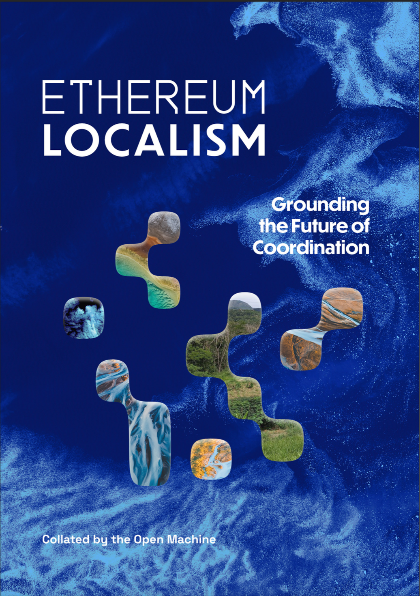

Ethereum  Localism

Welcome! **ethereumlocalism.xyz** is an open knowledge garden and action-oriented research hub dedicated to propagating the meme and practice of Ethereum Localism.

**Ethereum Localism** bridges digital innovation with real-world impact through community-driven initiatives, enabling resilient and sustainable local economies powered by blockchain and peer-to-peer technologies. Tools and mechanisms like quadratic funding, local stablecoins, and decentralized governance and finance expand Ethereum’s utility beyond digital spaces to create tangible local impacts.

This movement and knowledge hub only exist with your participation - check out the resources here on the site, and get involved!

[An Introduction to Ethereum Localism →](/introduction)

---

## Explore Our Digital Knowledge Garden

Our Digital Knowledge Garden is an interconnected collection of ideas, concepts, and resources on Ethereum Localism. The Knowledge Garden grows through community contributions and provides a rich, networked understanding of the movement.

_What is heavy should be local. What is light should be global and shared._ Welcome to the garden.

    <h3>Introduction</h3>
    
An introduction to Ethereum Localism.

    <a href="/introduction">Read →</a>
  

  

    <h3>Library</h3>
    
Curated collection of resources foundational to the movement.

    <a href="/library">Learn →</a>
  

  
  

    <h3>Resources</h3>
    
Tools, templates, and community to support your localism work.

    <a href="/resources">Explore →</a>
  

  

    <h3>Action Kit</h3>
    
Get started creating local impact, powered by Ethereum.

    <a href="/introduction/action-kit">Act →</a>
  

---

## Get Involved

**Join the growing community network of Ethereum Localists working toward more resilient, equitable, and regenerative local systems.**

  

    <h3>Connect</h3>
    
Join the conversation in our Telegram chat.

    <a href="https://t.me/+5Enk4J4d98MyMDkx">Join on Telegram →</a>
  

  

    <h3>Contribute</h3>
    
Add your experience and expertise to our Knowledge Garden.

    <a href="/contribution-guide">Contribution Guide →</a>
  

---

## Featured Resource: GFEL Boulder 2025 Video Recap

The most recent gathering of [a General Forum on Ethereum Localism (GFEL) in Boulder](library/GFEL/GFEL-2025-Boulder-Documentation) was more than a conference—it was a living inquiry into how we build and sustain systems of coordination, community, and care in a time of both precarity and possibility.

As you’ll see in the recap, Ethereum Localism is not a fixed ideology, rather it's a collaborative design space—where tools like DAOs, local currencies, and cosmo-local infrastructure are combined with deeply rooted local action to be wielded not for profit alone, but in service of regeneration, reciprocity, and collective resilience.

---

## Keep Reading

**Ethereum Localism: Grounding the Future of Coordination**
Collated by The Open Machine (February 2025)

**==Explore Ethereum Localism: Grounding the Future of Coordination as navigable Knowledge Garden pages:==**
[Start Reading →](library/Ethereum-Localism/ethereum-localism-book/index)

Download the book PDF [here](https://qxvqdga4v2uhlcgh7bvl5m6rukrhmesy6uzingqov76jw5miy3ka.arweave.net/hesBmByuqHWIx_hqvrPRoqJ2Elj1MoaaDq_8m3WIxtQ), and claim a free NFT version on [Manifold](https://app.manifold.xyz/c/ethereum-localism)

